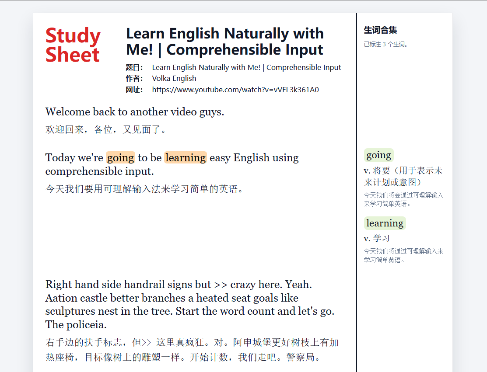
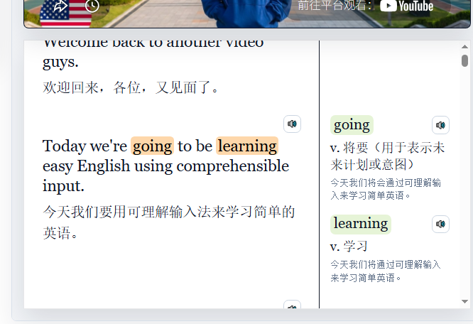
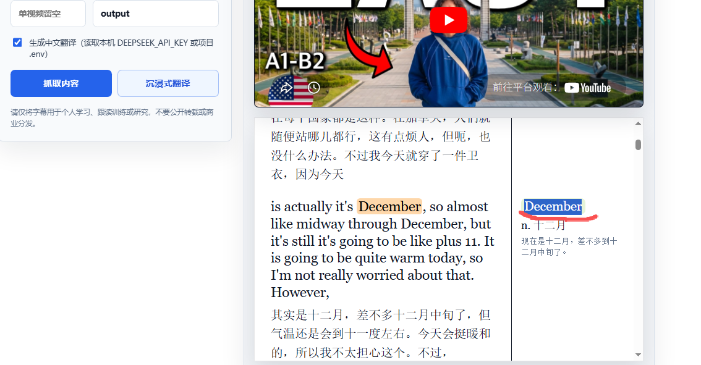

# Subtitle Studio

Subtitle Studio is a local-first study tool for turning YouTube transcripts and public articles into bilingual intensive-reading sheets.

It can fetch subtitles, translate them with DeepSeek, generate a side-by-side study layout, collect vocabulary notes, read text aloud, and export the final sheet as HTML, DOCX, or PDF.

Live demo: [youtube-subtitle-peach.vercel.app](https://youtube-subtitle-peach.vercel.app)

> The demo is currently open for quick testing. For a wider public release, set `APP_USERNAME` and `APP_PASSWORD` in Vercel to protect your API quota.

## Screenshots

### Study Sheet Export



### Inline Vocabulary Notes



### Word Audio and Reading Support



## Features

- Fetch transcripts from YouTube videos, playlists, and channels when captions are available.
- Extract readable text from public article URLs.
- Translate English content into Chinese with DeepSeek.
- Generate an immersive bilingual study sheet with English paragraphs, Chinese translations, highlighted vocabulary, and right-side vocabulary notes.
- Right-click or select words and phrases to build a vocabulary collection.
- Export study sheets as HTML, DOCX, or PDF.
- Keep the exported layout close to the in-browser study sheet, including highlighted words and the vocabulary sidebar.
- Read the whole article, one paragraph, or a single word aloud.
- Choose browser voices or server-generated TTS, depending on the environment.
- Embed a video player next to the study sheet for pause-and-repeat learning.
- Protect public deployments with a shared username and password.
- Run locally, in Docker, or on Vercel Container Images.

## Supported Sources

Currently supported:

- YouTube videos with accessible captions
- YouTube playlists and channels
- Public article pages that can be read without login

Planned or experimental:

- X, Instagram, Facebook, Netflix, Amazon Prime Video, and other media sites

Those platforms often require login, block scraping, or restrict subtitle access. Support depends on available captions, platform rules, and your own authorized access.

## Tech Stack

- Python standard-library HTTP server
- `youtube-transcript-api` and `yt-dlp` for subtitle access
- BeautifulSoup for public article extraction
- DeepSeek Chat Completions API for translation and vocabulary explanation
- `python-docx` for DOCX export
- Chromium print-to-PDF flow for PDF export
- `edge-tts` and browser speech synthesis for audio playback
- Docker and Vercel Container Images for deployment

## Quick Start

### 1. Clone the repository

```bash
git clone https://github.com/Mumuz495/YOUTube-subtitle.git
cd YOUTube-subtitle
```

### 2. Create an environment file

```bash
cp .env.example .env
```

On Windows PowerShell:

```powershell
Copy-Item .env.example .env
```

Open `.env` and add your DeepSeek API key:

```text
DEEPSEEK_API_KEY=your_deepseek_api_key_here
PORT=8765
HOST=127.0.0.1
```

The app can still fetch original transcripts without a DeepSeek key, but translation and vocabulary analysis require `DEEPSEEK_API_KEY`.

### 3. Install Python dependencies

macOS or Linux:

```bash
python3 -m venv .venv
source .venv/bin/activate
python -m pip install -r requirements.txt
```

Windows PowerShell:

```powershell
py -m venv .venv
.\.venv\Scripts\Activate.ps1
py -m pip install -r requirements.txt
```

### 4. Start the app

macOS or Linux:

```bash
python app.py
```

Windows PowerShell:

```powershell
py app.py
```

Open:

```text
http://127.0.0.1:8765/
```

## One-Command Resume on a New Computer

After cloning the repository on a new computer, run:

```bash
cp .env.example .env
python3 -m venv .venv
source .venv/bin/activate
python -m pip install -r requirements.txt
python app.py
```

Windows PowerShell version:

```powershell
Copy-Item .env.example .env
py -m venv .venv
.\.venv\Scripts\Activate.ps1
py -m pip install -r requirements.txt
py app.py
```

Then edit `.env` and add your local `DEEPSEEK_API_KEY`.

## Environment Variables

| Variable | Required | Default | Description |
| --- | --- | --- | --- |
| `DEEPSEEK_API_KEY` | For translation | Empty | DeepSeek API key used for Chinese translation and vocabulary explanations. |
| `PORT` | No | `8765` | Local web server port. |
| `HOST` | No | `127.0.0.1` | Bind address for local use. Use `0.0.0.0` in containers. |
| `APP_USERNAME` | Public deploys | `friend` | Basic-auth username. |
| `APP_PASSWORD` | Public deploys | Empty | Basic-auth password. Set this before sharing the site. |
| `PUBLIC_DEPLOYMENT` | Public deploys | `0` | Enables safer public defaults. |
| `ALLOW_CUSTOM_OUTPUT_DIR` | No | Local only | Whether users can choose custom output directories. Disable this in public deployments. |
| `RATE_LIMIT_ENABLED` | Public deploys | Auto | Enables POST request rate limiting. |
| `RATE_LIMIT_MAX_REQUESTS` | No | `60` | Max POST requests per rate-limit window. |
| `RATE_LIMIT_WINDOW_SECONDS` | No | `600` | Rate-limit window length. |
| `OUTPUT_RETENTION_HOURS` | Public deploys | `0` locally | Removes generated output files after the configured time. |
| `MAX_REQUEST_BYTES` | No | `8388608` | Maximum accepted JSON request body size. |
| `PDF_MAX_UPLOAD_BYTES` | No | `209715200` | Maximum accepted multipart PDF upload size (default 200 MB). |

## PDF Upload Limits

- Small PDF uploads can still use the legacy JSON endpoint `POST /api/pdf`.
- The web UI now prefers `POST /api/pdf-upload` with `multipart/form-data`, so large PDFs are not expanded into base64 JSON.
- Local development supports large scan PDFs up to `PDF_MAX_UPLOAD_BYTES` (default `200 MB`).
- Scan PDFs may trigger Windows OCR and can take several minutes. The UI shows an OCR-in-progress message while waiting.
- Hosted platforms may enforce their own request-body limits. Vercel and many reverse proxies cap uploads far below 200 MB, so very large PDFs are best handled on local `py app.py` or your own server/container.

The study sheet can be exported as:

- `study-sheet.html`
- `study-sheet.docx`
- `study-sheet.pdf`

Generated files are stored under `output/`. On hosted platforms, generated files usually live on temporary container storage, so download DOCX/PDF files soon after creating them.

## Deploy to Vercel

This project includes `Dockerfile.vercel`, so Vercel can deploy it as a Container Image.

Install Node dependencies:

```bash
npm install
```

Login and deploy:

```bash
npx vercel login
npx vercel --prod
```

Or, after the project is linked:

```bash
npm run vercel:deploy
```

Set these Vercel environment variables:

```text
DEEPSEEK_API_KEY=your_deepseek_key
APP_USERNAME=friend
APP_PASSWORD=choose_a_strong_password
PUBLIC_DEPLOYMENT=1
ALLOW_CUSTOM_OUTPUT_DIR=0
RATE_LIMIT_ENABLED=1
OUTPUT_RETENTION_HOURS=24
MAX_REQUEST_BYTES=8388608
```

See [VERCEL_DEPLOY.md](VERCEL_DEPLOY.md) for more details.

## Docker

Build and run the standard local container:

```bash
docker build -t subtitle-studio .
docker run --rm -p 8765:8765 --env-file .env -e HOST=0.0.0.0 subtitle-studio
```

Build and test the Vercel container locally:

```bash
docker build -f Dockerfile.vercel -t subtitle-studio-vercel .
docker run --rm -p 8765:80 --env-file .env -e APP_USERNAME=friend -e APP_PASSWORD=local-test-pass subtitle-studio-vercel
```

## Development Checks

Run the full preflight check before deploying:

```bash
python scripts/preflight.py
```

Windows PowerShell:

```powershell
py scripts\preflight.py
```

The preflight check verifies required files, scans for accidentally committed API keys, checks `.gitignore`, compiles Python files, runs unit tests, and validates deployment-related files.

## Repository Hygiene

Do not commit:

- `.env`
- `.env.local`
- `.vercel/`
- `.tools/`
- `output/`
- `node_modules/`
- API keys or passwords

The repository includes `.env.example` so every computer can recreate its own local environment safely.

## Notes on Copyright and Platform Rules

Use downloaded transcripts, article text, generated translations, DOCX files, PDFs, and audio only for personal study, shadowing, language learning, or research.

Do not redistribute copyrighted transcripts, articles, videos, or generated study sheets unless you have permission to do so. Some platforms may restrict automated subtitle access, and this project does not bypass paid access, private content, DRM, or login-only content.
